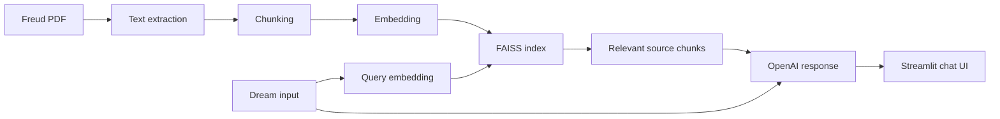

# Freud Dream RAG Chatbot

프로이트의 `The Interpretation of Dreams` 원문을 검색 기반으로 참조하고, OpenAI API로 꿈 해석 스타일의 답변을 생성하는 **RAG 기반 Streamlit 토이 프로젝트**입니다.

핵심 목표는 실제 심리 상담 서비스가 아니라, 문서 기반 LLM 앱에서 중요한 **source transparency, retrieval flow, safety disclaimer**를 작은 주제로 구현해보는 것이었습니다.

## What It Does

- PDF 문서를 chunk로 나누고 embedding을 생성합니다.
- FAISS vector index에서 사용자의 꿈 내용과 관련된 원문 구절을 검색합니다.
- 검색된 구절을 OpenAI prompt context로 전달합니다.
- 답변에서 문헌 기반 설명과 추론적 해석을 분리해 보여줍니다.
- Streamlit chat UI에서 대화형으로 사용할 수 있습니다.

## Tech Stack

| Area | Stack |
|---|---|
| App | Python, Streamlit |
| Retrieval | FAISS, LangChain text splitter |
| Embedding | intfloat/multilingual-e5-base |
| LLM | OpenAI API |
| Data | Public domain Freud text PDF |
| Runtime | Python 3.11+ |

## Architecture



## Key Files

| Path | Role |
|---|---|
| `app/app.py` | Streamlit chat app and RAG response flow |
| `scripts/build_index.py` | PDF loading, chunking, embedding, FAISS index build |
| `data/freud_dreams.pdf` | Public domain source text |
| `index/` | FAISS index and chunk metadata |
| `requirements.txt` | Python dependencies |

## Run Locally

```bash
git clone https://github.com/chi2hoon/dream_bot.git
cd dream_bot

python -m venv venv
source venv/bin/activate
pip install -r requirements.txt
```

OpenAI API key는 Streamlit secrets로 설정합니다.

```bash
mkdir -p .streamlit
printf 'OPENAI_API_KEY = "your_openai_api_key_here"\n' > .streamlit/secrets.toml
```

필요하면 인덱스를 다시 생성합니다.

```bash
python scripts/build_index.py
```

앱 실행:

```bash
streamlit run app/app.py
```

## Safety Disclaimer

- 이 프로젝트는 오락과 학습 목적의 AI toy project입니다.
- 프로이트의 꿈 해석 이론은 현대 심리학의 검증된 진단 도구가 아닙니다.
- 실제 심리적 어려움, 위기 상황, 의료적 판단이 필요한 경우 전문가에게 상담해야 합니다.
- 사용자는 개인정보나 민감한 내용을 입력하지 않는 것이 좋습니다.

## Portfolio Notes

이 프로젝트에서 보여주고 싶은 역량은 도메인 지식 자체보다 다음에 가깝습니다.

- 문서 기반 RAG application 구성
- source chunk 검색과 answer generation 연결
- Streamlit으로 빠르게 interactive prototype 구현
- API key를 코드에 넣지 않는 secrets 관리 방식
- 사용자에게 모델의 한계를 알리는 safety copy 작성

## Next Steps

- retrieval quality를 확인할 수 있는 예시 query set 추가
- 답변에서 source quote와 interpretation을 더 명확히 분리
- 작은 smoke test 또는 py_compile 기반 검증 스크립트 추가
- Streamlit Cloud 배포 문서 보강
